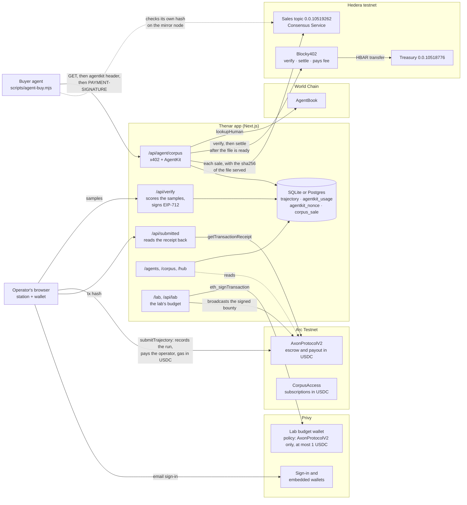

# Thenar on Arc

**Robot training data, recorded by people, paid per run in USDC, and bought by
agents.** An operator drives a robot arm in the browser; a verifier scores the
recording against the goal and signs; one transaction on Arc records the
trajectory and pays the operator from escrowed USDC, with gas from the same
balance. An AI agent that wants a task's corpus asks for it over HTTP, is
answered `402`, and either pays on Hedera through x402 or shows through World
AgentKit that a verified human stands behind it. A lab funds the bounties from a
Privy wallet whose policy lets it spend on nothing else.

A **Continuity** project for ETHOnline 2026. Thenar was built at Monad Blitz
Hyderabad V3 (3rd place) and ran on Avalanche Fuji afterwards. What existed
before this event and what was built during it are separated
[below](#what-existed-before-ethonline-and-what-is-new), with the commits.

| | |
| --- | --- |
| **Runs and payouts** | Arc Testnet, chain 5042002. Bounties, payouts and gas are all USDC. |
| **Agent payments** | Hedera testnet, x402 `exact` scheme in HBAR, settled by the [Blocky402](https://api.testnet.blocky402.com/supported) facilitator |
| **Sales log** | A Hedera Consensus Service topic only the seller can post to; every pull is logged with the sha256 of the file served |
| **Agent identity** | World AgentKit; AgentBook on World Chain (480) decides who gets free pulls |
| **Wallets** | Privy: operators sign in with an email and get an embedded wallet on Arc; a lab's budget is a Privy server wallet whose policy only lets it fund bounties |
| **Repo** | https://github.com/nickthelegend/thenar-io |
| **Submission notes** | [SUBMISSION.md](SUBMISSION.md) · World feedback: [docs/FEEDBACK-WORLD.md](docs/FEEDBACK-WORLD.md) |

Everything below is on testnets and every link is to a real transaction.

---

## Architecture



---

## What is proven, with links

### Arc Testnet

The contracts, unchanged Solidity from the Avalanche build, redeployed on Arc
([`contracts/script/DeployArc.s.sol`](contracts/script/DeployArc.s.sol),
[`DeployArcExtras.s.sol`](contracts/script/DeployArcExtras.s.sol)). The value
they escrow and pay is the chain's native value, which on Arc is USDC, so none
of them needed a token interface to become dollar-denominated. All ten are
source-verified on Sourcify with `exact_match`, so the deployed bytecode is this
repository's Solidity (for example
[AxonProtocolV2](https://sourcify.dev/server/v2/contract/5042002/0x6D6D6D0ee86C654b69646223049D6812c0218B2f)),
and Arcscan shows the verified source for all ten.

| Contract | Address | Does |
| --- | --- | --- |
| AxonProtocolV2 | [`0x6D6D6D0e…0218B2f`](https://testnet.arcscan.app/address/0x6D6D6D0ee86C654b69646223049D6812c0218B2f) | Tasks, escrow, trajectories, payouts. Eight tasks: five seeded with 1.5 USDC, and #5–#7 funded from the Privy lab wallet. |
| TrajectoryCertificate | [`0x9dAc88a5…B9B7B`](https://testnet.arcscan.app/address/0x9dAc88a501F908FFaF41F4e0c6071c1F8B6B9B7B) | Soulbound record of who recorded a run |
| ContributionRecord | [`0x940a9A5C…25523`](https://testnet.arcscan.app/address/0x940a9A5CB219D5061748AD10b1Dd38f82C825523) | Running total of work recorded |
| CorpusAccess | [`0x14588B2b…B7Bc8`](https://testnet.arcscan.app/address/0x14588B2b26c3af1D0dDabc386fCe659d662B7Bc8) | A day of corpus access for a cent of USDC |
| PasskeyRegistry | [`0xecbbC9d4…7615e`](https://testnet.arcscan.app/address/0xecbbC9d43eF7C4E4Df00BC02757b8FC3E3b7615e) | P-256 keys, verified through the precompile at `0x0100`, which answers on Arc |
| Referrals | [`0x4688D98C…9971d`](https://testnet.arcscan.app/address/0x4688D98Ca5813CA9c4702AcBbfED28B88dF9971d) | Two cents of USDC for bringing someone who then does the work; 0.1 USDC pot |
| Foundry | [`0x3c6eAaeE…a6846`](https://testnet.arcscan.app/address/0x3c6eAaeEb14743944b6AC37aBBfAd6aD735a6846) | Treasury contributors vote to spend on new tasks; 0.2 USDC |
| PrizePool | [`0x39C7983E…d8b13`](https://testnet.arcscan.app/address/0x39C7983E14ad17FA24399d8394E36EFcBd6d8b13) | Funded pot for task 1, split by recorded work; 0.1 USDC |
| ConfidentialPayouts | [`0x02376942…93003`](https://testnet.arcscan.app/address/0x023769421D2501E7F9cF06c1F677d85C1C393003) | ElGamal on secp256k1: totals add up without the chain holding a number |
| CorpusManifest | [`0x956f1Bf0…148f8`](https://testnet.arcscan.app/address/0x956f1Bf0dd1CE3Af862388E643e708c4C37148f8) | The committed Merkle root of each task's corpus. Tasks 1 and 2 committed by the verifier on 13 September ([`0xd779a45a…`](https://testnet.arcscan.app/tx/0xd779a45a2de0f38c7b5dc1ba83a9a6fa5b3d40ce8681e8c44789c04c1b57eed3), [`0x907bcc1b…`](https://testnet.arcscan.app/tx/0x907bcc1bdf0ef458517cc4204707034528e55be7f5dd11596da92deb5030546d)), each with an episode's proof checked by the contract |

Runs, each scored and signed by the verifier and submitted by a fresh operator
key with [`scripts/arc-run.mjs`](scripts/arc-run.mjs). Each paid **0.0225 USDC**
(score 45.00 of a 0.05 USDC bounty) inside the transaction that recorded it, and
each operator's balance rose by exactly that net of gas, because the gas came out
of the same USDC.

| Task | Transaction | Arm holds the payload? |
| --- | --- | --- |
| 1 | [`0x6d24002f…8242b2`](https://testnet.arcscan.app/tx/0x6d24002f52c29db71e4bec3a332ad9b9f73888cd7a473bf4e31cb0ccad8242b2) | No — first version of the script |
| 1 | [`0xfbddfe56…f0605a`](https://testnet.arcscan.app/tx/0xfbddfe563e2dc440fe71178c15ca6c3c6f5c6437491ee9af0053106788f0605a) | No — first version of the script |
| 2 | [`0xb59f1c4a…e01bb`](https://testnet.arcscan.app/tx/0xb59f1c4a85e7d4d31f1fbb84099242058830e08b504687610a795536883c01bb) | No — first version of the script |
| 1 | [`0xa9962cb8…c272e`](https://testnet.arcscan.app/tx/0xa9962cb8844de65cace708e06faa1d2aa2aaaaec895cb4a451362c60be2c272e) | Yes — joints solved from the payload, 0.0 mm |
| 2 | [`0x9d54e8f8…aa2a0`](https://testnet.arcscan.app/tx/0x9d54e8f8b2b9f6fb46da415bd1a5da4f14d172f98e7b6ea0d836e7c71aeaa2a0) | Yes — joints solved from the payload, 0.0 mm |

The first three are real, paid, and not usable as training data: the script
ramped the joints while the payload moved on its own. The product's own
coherence check catches exactly that, and `/api/dataset/summary` reports task 1
as 1 of 3 trainable and task 2 as 1 of 2. They are left on the ledger and
labelled rather than hidden.

### Hedera testnet

| What | Id | Detail |
| --- | --- | --- |
| Agent account | [`0.0.10518775`](https://hashscan.io/testnet/account/0.0.10518775) | ECDSA, alias `0x9a6c46e7…cb63aa` — the agent's own EVM key. Created by [`scripts/hedera-setup.mjs`](scripts/hedera-setup.mjs). |
| Corpus treasury | [`0.0.10518776`](https://hashscan.io/testnet/account/0.0.10518776) | What `/api/agent/corpus` asks agents to pay |
| Paid pull, task 1 | [`0.0.7162784@1789279979.058986056`](https://hashscan.io/testnet/transaction/0.0.7162784-1789279979-058986056) | `SUCCESS`: agent −0.5 HBAR, treasury +0.5 HBAR, fee paid by Blocky402 (`0.0.7162784`) |
| Paid pull, task 2 | [`0.0.7162784@1789281472.024056054`](https://hashscan.io/testnet/transaction/0.0.7162784-1789281472-024056054) | `SUCCESS`: agent −0.5 HBAR, treasury +0.5 HBAR, fee paid by Blocky402 |

| Sales topic | [`0.0.10519262`](https://hashscan.io/testnet/topic/0.0.10519262) | Consensus Service; only the treasury's key can post to it. Created in `0.0.9842030@1789282023.896089542`. |
| Paid pull, task 1, logged | [`0.0.7162784@1789282116.389653271`](https://hashscan.io/testnet/transaction/0.0.7162784-1789282116-389653271) | `SUCCESS`: agent −0.5 HBAR, treasury +0.5 HBAR. Logged as [message #1](https://testnet.mirrornode.hedera.com/api/v1/topics/0.0.10519262/messages/1), posted by the treasury, with sha256 `2539ff76…d4008b61`. The agent hashed the three-episode file it received and read the same digest from the mirror node. |

| Paid pull, task 1, logged | [`0.0.7162784@1789290611.109538307`](https://hashscan.io/testnet/transaction/0.0.7162784-1789290611-109538307) | Settled by Blocky402. Logged as [message #2](https://testnet.mirrornode.hedera.com/api/v1/topics/0.0.10519262/messages/2). |
| Paid pull, task 1, logged | [`0.0.7162784@1789296779.408785255`](https://hashscan.io/testnet/transaction/0.0.7162784-1789296779-408785255) | Settled by Blocky402, run again on 13 September. Logged as [message #3](https://testnet.mirrornode.hedera.com/api/v1/topics/0.0.10519262/messages/3); the buyer's own sha256 of the file it received, `424220d1…3ac988`, matched it. |

All five pulls are rows in `corpus_sale` and on the `/agents` page, each linked
to its Hashscan transaction. The first two came before the sales topic existed
and are shown as unlogged rather than backfilled.

### Hedera: the corpus as a security, through the Asset Tokenization Studio

| What | Id | Detail |
| --- | --- | --- |
| Security | [`0.0.10520394`](https://hashscan.io/testnet/contract/0.0.10520394) | "Thenar Robot Corpus", THNRC, ISIN USTHNRCRP019, EVM `0xDbf28C5C8cb5FA8960Bf413E6353B33066F20Fb7`. Equity with a common dividend right. |
| Issuance | [`0x983b1e62…61fbcb3`](https://hashscan.io/testnet/transaction/0x983b1e62e8d32b59fe148e3676806d3c5252a0dfd5fab0e7d5a73de1161fbcb3) | `Factory.deployEquity` on the ATS factory `0.0.9213391` (resolver `0.0.9212226`). SUCCESS. |
| Configuration | [`0x3ba258ab…63082bfe`](https://hashscan.io/testnet/transaction/0x3ba258ab0d021ddd3c16a71bd7de91859fc03ba31d5fb2d7ae488a0663082bfe) | Whitelist control list on, so only listed addresses can hold; issuer added to it. SUCCESS. |

Read back from Hedera's mirror node: `name()` is "Thenar Robot Corpus",
`symbol()` is "THNRC", and both transactions report SUCCESS. The issuer is
testnet operator `0.0.9842030`, which holds the admin, issuer, control-list and
corporate-actions roles.

Lifecycle, run with `scripts/ats-lifecycle.mjs` on the live security:

| Operation | Transaction | Result |
| --- | --- | --- |
| Compliance check | none (simulated) | Issuing a share to the agent wallet, which is not on the whitelist, is refused by the security with `AccountIsBlocked`; the same issue to the issuer passes. |
| Issuance | [`0x9085a810…b8c6291c`](https://hashscan.io/testnet/transaction/0x9085a8101bca4cc72e471b48acd9e2e3a294a3af27a27b0f42a82bbcb8c6291c) | `issueByPartition`: 1,000 shares of treasury reserve to the issuer. SUCCESS. |
| Distribution | [`0x8f0f9034…3cb04cb1`](https://hashscan.io/testnet/transaction/0x8f0f9034af3d4539b9f0aebac279ffc7073b454a64dc0a7b0d7657d43cb04cb1) | `setDividend`: dividend #1, 0.05 per share according to the script. SUCCESS. |

Afterwards `totalSupply()` reads 1,000 and the issuer's `balanceOf` reads 1,000;
the security has 0 decimals.

The security's contract, a `ResolverProxy` from
`@hashgraph/asset-tokenization-contracts` 8.0.0, is source-verified with an
`exact_match` on
[Sourcify](https://repo.sourcify.dev/296/0xDbf28C5C8cb5FA8960Bf413E6353B33066F20Fb7),
which HashScan's verification uses. Its runtime bytecode matches. There is no
creation match, because the ATS factory created it inside `deployEquity`.

### Privy

| What | Id | Detail |
| --- | --- | --- |
| Lab policy | `sf7wzkldy5364a56jol16spa` | Two ALLOW rules, for `eth_sendTransaction` and `eth_signTransaction`: `to` is AxonProtocolV2, `chain_id` is 5042002, `value` is at most 1 USDC. A wallet with a policy is refused anything no rule allows. |
| Lab wallet | [`0x7b4d4a77…0E44E51a`](https://testnet.arcscan.app/address/0x7b4d4a773fCA1E20D2361411B34655210E44E51a) | Privy server wallet `t3f4kq36uzu0zieqd5i425p0`, created with the policy attached; its key exists only inside Privy. Topped up with 1.5 USDC from the deployer in [`0x56ccbaba…`](https://testnet.arcscan.app/tx/0x56ccbababc924e9b84c9c788994a33f559f86cad23634c7d5fe55f4cf91ab56c). |
| A bounty from the budget | [`0x7a7c387f…f6d9291c`](https://testnet.arcscan.app/tx/0x7a7c387f00110499e4e2c4d6665bb120ecbe7db716012d8a35338797f6d9291c) | From the lab wallet to AxonProtocolV2, 0.4 USDC, success in block 61860451: task #5, two runs at 0.2 USDC. Signed by Privy under the policy. |
| A bounty from the page | [`0x5ef56687…2e3f8c`](https://testnet.arcscan.app/tx/0x5ef56687df9d4db9baf510a5f53f093c79cb54ef587b3b07f11d98c9b42e3f8c) | Posted from `/lab` on 13 September: task #7, one run at 0.01 USDC, success in block 61886811. Clicked twice, posted once. |
| Spending it elsewhere | none | Asked to sign a 0.01 USDC transfer to the deployer, Privy answered `400 policy_violation` ("RPC request denied due to policy violation") and signed nothing. Asked again from the `/lab` page on 13 September, with the same refusal. |

Privy will not broadcast on Arc for this app (`App is not authorized to transact
on chain eip155:5042002`), so the app broadcasts what Privy signs. The policy
still applies, because Privy enforces it when it signs.

### World

- The paywall's 402 carries an AgentKit challenge for `eip155:480`. The agent
  signs it (EIP-191) and retries; the server validates the message, checks the
  nonce against the database, verifies the signature, and asks
  [AgentBook](https://worldscan.org/address/0xA23aB2712eA7BBa896930544C7d6636a96b944dA)
  on World Chain whether a human stands behind the wallet.
- For the agent above, AgentBook answered **not registered**, so both pulls were
  paid. `GET /api/agent/status?address=…` makes the same lookup on demand.
- Free pulls for human-backed agents are counted in the database
  (`agentkit_usage`), not in memory, so a restart does not reset a trial.

---

## The payment flow, step by step

`GET /api/agent/corpus?taskId=N` ([route](app/api/agent/corpus/route.ts)).

1. **No headers.** The server answers `402`. The offer is in the
   `PAYMENT-REQUIRED` header and, decoded, in the body:
   `accepts[0] = { scheme: "exact", network: "hedera:testnet", amount: "50000000", asset: "0.0.0", payTo: "0.0.10518776", extra: { feePayer: "0.0.7162784" } }`,
   plus `extensions.agentkit` with a fresh nonce.
2. **AgentKit.** The agent's `createAgentkitClient` signs the challenge with its
   wallet and retries with an `agentkit` header. The server's `requestHook`
   validates it and calls `AgentBook.lookupHuman`. A human with free pulls left
   is granted the file with no payment, recorded as an `agentkit` sale. Anyone
   else gets a new `402`.
3. **x402.** `@x402/fetch` builds a Hedera `CryptoTransfer` of 0.5 HBAR from the
   agent's account to the treasury, with Blocky402 as fee payer, signs it with
   the agent's key, and retries with `PAYMENT-SIGNATURE`.
4. **Verify.** The server sends the payment to Blocky402's `/verify`.
5. **The file.** Only now does the route build the corpus. A task with nothing
   recorded answers `404`, and a response of 400 or above is never settled, so
   the agent is not charged for nothing.
6. **Settle.** Blocky402's `/settle` submits the transfer. The response carries
   `PAYMENT-RESPONSE` with the Hedera transaction id, which the server records in
   `corpus_sale`.
7. **Log.** The server hashes the exact bytes it is returning, posts the sale
   and that sha256 to the sales topic with the treasury's key, and returns the
   digest and the message's sequence number in `x-thenar-sha256` and
   `x-thenar-audit`. The buyer hashes what it received and reads the message
   from Hedera's mirror node, not from this server. If the post fails, the file
   is still served — the payment has already settled — and the gap is recorded
   with its reason.

One key does both jobs: `AGENT_PRIVATE_KEY` signs the AgentKit challenge and is
the key of Hedera account `0.0.10518775`, created with that key's EVM address as
its alias. The identity that could earn a free pull and the account that pays
when it doesn't cannot belong to two different parties.

Two things had to be fixed at the seam between AgentKit 0.2.1 and x402 2.25, and
both are written up in [docs/FEEDBACK-WORLD.md](docs/FEEDBACK-WORLD.md): the
AgentKit client reads the offer from the body while x402 v2 sends it in a header,
and a paid retry failed with `extension_echo_mismatch` until the challenge's
nonce and timestamps were declared dynamic.

---

## What existed before ETHOnline, and what is new

**Boundary:** commit
[`e4f131d`](https://github.com/nickthelegend/thenar-io/commit/e4f131d) on
2026-09-03 is the last commit before the event. `git log e4f131d..HEAD` is the
work done during it; `git diff --stat e4f131d..HEAD` is its size.

**Before** (Monad Blitz, then Avalanche Fuji): the browser station and arm
simulation, the verifier and its scoring, all the Solidity in `contracts/src`,
the corpus export and its coherence check, CorpusAccess subscriptions, passkey
submission, ElGamal payouts, the archive of earlier chains.

**During ETHOnline 2026:**

- *2026-09-10, on the Avalanche build* — ten commits: an empty standings window,
  RPC fallback across endpoints, degraded-browser QA, a pageview counter that
  could fail the site, the referral pot made visible.
- *Arc* — every contract redeployed on Arc Testnet and funded in USDC; chain
  config, CSP and registry moved to Arc; the per-address history that came from
  Avalanche's Glacier now comes from Arcscan (`lib/glacier.ts`,
  `/api/calls/[address]`); the Warp attestation and the `/l1` page removed
  because Arc has neither; `scripts/arc-run.mjs`, which solves the arm's joints
  from the payload so a scripted run is a coherent one.
- *Hedera* — the x402 paywall on `/api/agent/corpus` settled by Blocky402, the
  agent and treasury accounts, the buyer agent, the `corpus_sale` ledger, the
  Consensus Service sales log carrying the sha256 of every file served,
  `/api/agent/sales`, and the `/agents` page.
- *Hedera tokenization* — the corpus issued as a security through the Asset
  Tokenization Studio (`scripts/ats-deploy.mjs`, `scripts/ats-lifecycle.mjs`,
  `/corpus-token`). Shares for paid runs are in progress.
- *World Selfie Check* — a human proof required before a run is signed
  (`/api/world/*`, `components/human-gate.tsx`). It is built and its World app
  is configured; no proof has been verified end to end yet.
- *Privy* — sign-in and embedded wallets in place of RainbowKit, the lab's
  budget wallet and its policy, `/lab`, `/api/lab` and `scripts/privy-lab.mjs`.
- *World* — AgentKit on the same route with AgentBook deciding free pulls,
  database-backed usage and nonce storage, `/api/agent/status`, and the
  integration feedback.
- *Shared* — the corpus export lifted out of `/api/dataset` into
  `lib/server/corpus-export.ts`, so a subscription on Arc and a payment on Hedera
  hand over the same file.

---

## Run it

Node 22 or later (the scripts import TypeScript directly), pnpm, and Foundry to
deploy.

```bash
pnpm install
cp .env.example .env.local        # fill in the 0x... values
pnpm dev --port 3222
```

A paid run on Arc (the deployer in `.env.deployer` funds a fresh operator with
0.05 USDC once the verifier has accepted its run):

```bash
node scripts/arc-run.mjs http://localhost:3222 1
```

The Hedera accounts, once, from any funded testnet operator:

```bash
HEDERA_OPERATOR_ENV=/path/to/file/with/HEDERA_OPERATOR_ID/and/KEY node scripts/hedera-setup.mjs
```

An agent buying task 1's corpus:

```bash
node scripts/agent-buy.mjs http://localhost:3222 1
```

A lab's budget in a Privy wallet, and a bounty posted from it. It needs
`PRIVY_APP_ID` and `PRIVY_APP_SECRET`, and creates the policy and the wallet the
first time:

```bash
node scripts/privy-lab.mjs
```

To let that agent earn free pulls, register its wallet in AgentBook with World
App, then run the buyer again:

```bash
npx @worldcoin/agentkit-cli register 0x9a6C46E7115CfB5FF5a2265E5a1B955038cb63aA
```

Deploying the contracts yourself:

```bash
cd contracts
set -a; . ../.env.deployer; set +a
forge script script/DeployArc.s.sol --rpc-url https://rpc.testnet.arc.network --broadcast
AXON_ADDRESS=<AxonProtocolV2 from the step above> \
  forge script script/DeployArcExtras.s.sol --rpc-url https://rpc.testnet.arc.network --broadcast
```

---

## Stated plainly: what is not proven

- **Testnets only.** Arc mainnet is not live, so none of this is on it.
- **Privy email sign-in has not been completed in a browser.** The provider and
  the embedded-wallet setup build, and the lab's server wallet works end to end,
  but finishing a sign-in needs the one-time code sent to a real inbox, and no
  operator's sign-in has been run through yet.
- **Privy does not broadcast on Arc for this app.** The lab wallet's
  transactions are signed by Privy and broadcast by this app.
- **Privy lists no Continuity track.** Thenar existed before the event; whether
  its Privy work is eligible for Privy's prizes is for ETHGlobal and Privy to say.
- **The Selfie Check gate has not verified a proof yet.** It is built, and a World
  app with Selfie Check enabled is configured, but no proof has gone through end
  to end.
- **Shares per paid run are not proven.** The security exists and is configured;
  issuing shares from a settled run is still in progress.
- **Hedera's ATS factory and resolver are not source-verified.** They are
  Hedera's deployments, not Thenar's; the security Thenar deployed is verified.
- **No run here was driven by a person.** All five Arc runs came from
  `scripts/arc-run.mjs`. The station works in the browser, but no human run has
  been submitted to this Arc deployment yet.
- **The free AgentKit path has not been exercised.** The agent wallet is not in
  AgentBook yet; registering it needs World App. Until then only the paid path is
  shown.
- **Not Circle's Agent Stack.** The agent pays in HBAR on Hedera; it does not
  hold a Circle wallet or pay in USDC on Arc. The USDC on Arc is the operators'
  bounties and payouts.
- **Not hosted.** thenar.io's old backend is gone. This deployment runs locally
  against the live testnets.
- **LicenceReceipt is not deployed on Arc.** It attests a policy through
  Avalanche's Warp precompile, which Arc does not have.

---

## History

The README from the Avalanche build, with its Monad and Fuji deployments and the
original demo, is kept at
[docs/history/README-avalanche.md](docs/history/README-avalanche.md).
